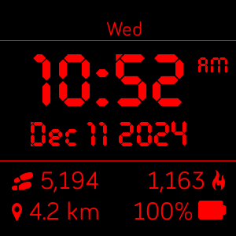

# Night Clock
 A Fitbit watch face made to resemble the red-on-black displays of old fashion clock radios. This wachface is a stripped down version of [Night Shift](https://github.com/jsh9091/night-shift) made for the Versa, Versa Lite, and Versa 2. 

[Fitbit App Gallery listing](https://gallery.fitbit.com/details/0835cd99-3d6e-4b4a-bf05-3d9601e02d5f?key=f77861b5-6261-4aba-89f2-d45133e97846) 

